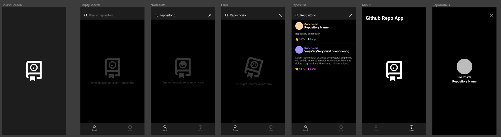
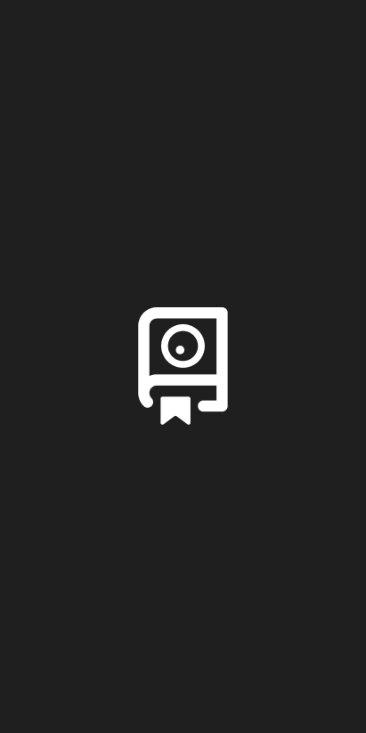
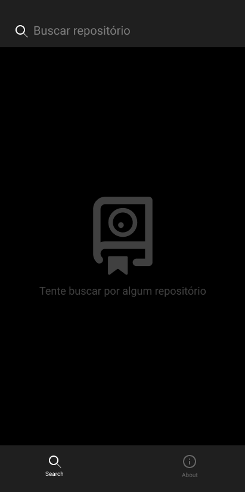
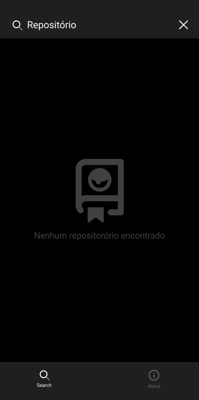
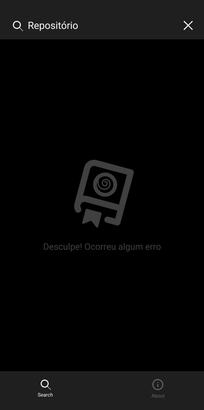
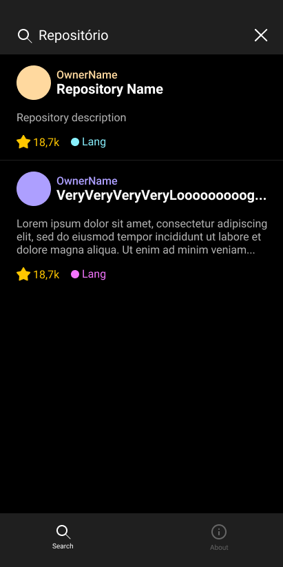
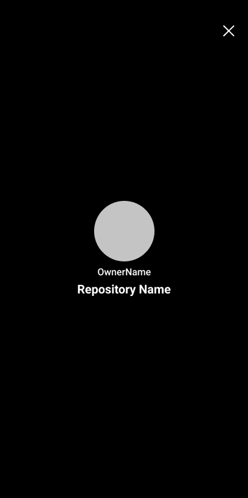
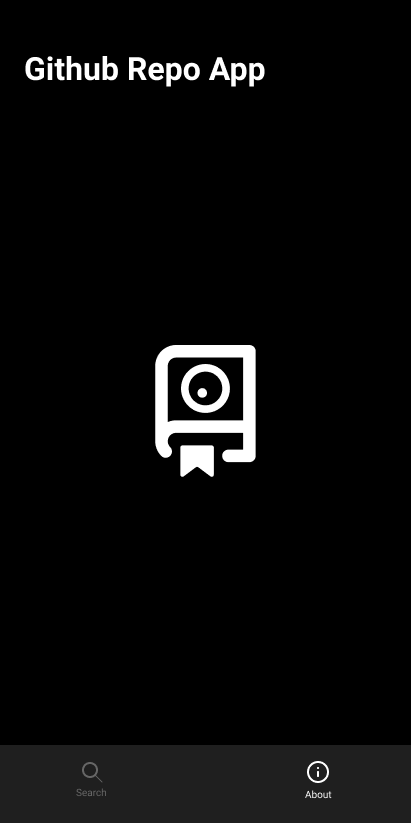
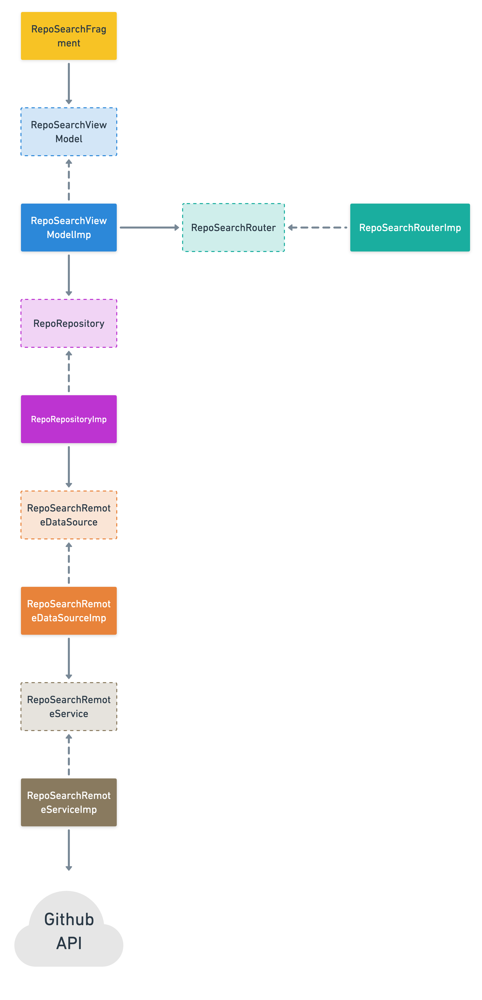
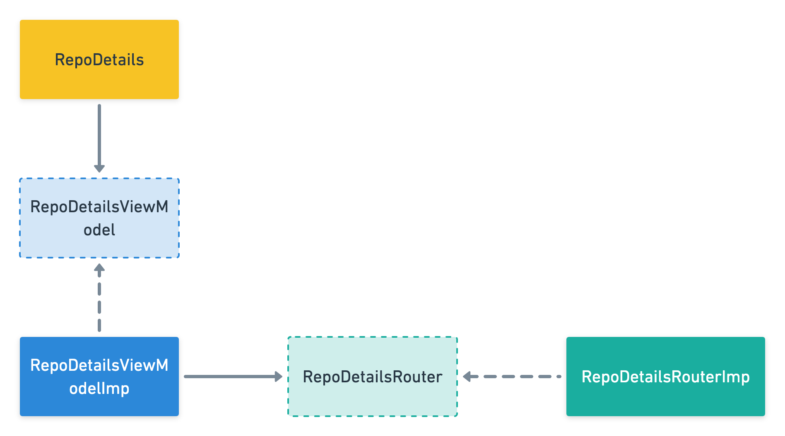

# Github Repo APP

Exemplo de App Android utilizando a API de busca de Repositórios do Github.

## Referências

## Design

<a href="https://www.figma.com/file/NnPw1t8RDT3MtcbouWoMQ3/github-repo-search?node-id=0%3A1">Projeto Figma</a>

### Splash Screen

Tela de Splash (_launch screen_) com a logo do app. Não só funciona como uma tela de apresentão inicial, mas também pode ser utilizada para o carregamento inicial das informações.

### Search Screen

Tela para realizar a busca dos repositórios. Essa tela possui 4 estados: vazia,
busca sem resultado, erro na busca e busca com resultados.

**Vazia**

Esse estado apenas contém uma mensagem dizendo que a lista está vazia.

**Sem resultados**

Esse estado apresenta uma mensagem dizendo que a última busca não retornou nenhum
resultado.

**Erro na busca**

Esse estado apresenta uma mensagem mostando que ocorreu algum erro durante a busca
(erro da API, erro por falta de conexão com a internet).

**Resultado da busca**

Esse estado apresenta uma lista com os resultados da busca realizada.

Cada item da lista apresenta: imagem do dono do repositório; nome do dono;
nome do repositório; descrição do repositório; quantidade de estrelas; principal
linguagem de programação do repositório.

### Details Screen

Essa tela apresenta os detalhes do repositório selecionado. Nela é apresentada:
imagem do dono do repositório; nome do dono; e nome do repositório.

### About Screen

Tela com iformações básicas do app. Nessa versão é apenas utilizada para apresentar
a navegação.

## Arquiteturas

### RepoSearch

### RepoDetails

